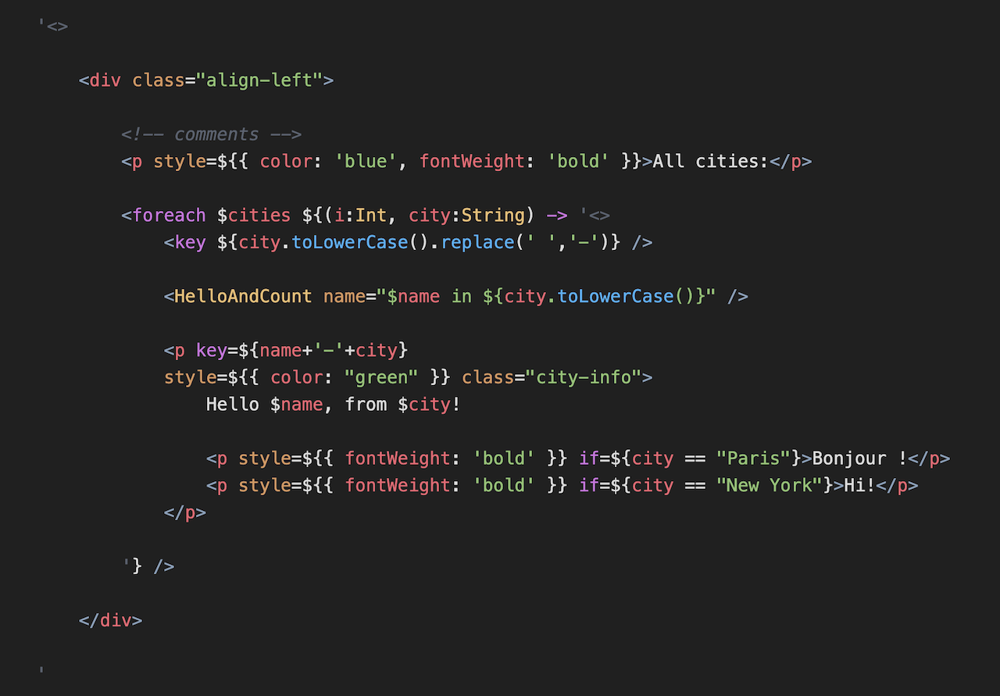

# Haxe Wisdom for Visual Studio Code

Language support for the markup of the [wisdom](https://github.com/jeremyfa/wisdom) Haxe library —
the `'<>...'` strings that describe a virtual DOM inline in Haxe code.



## What it does

**Syntax highlighting** of the markup inside Haxe single-quoted strings: tags, attributes, Wisdom's
control-flow tags and the Haxe interpolations in between.

**Completion, hover and go to definition** for the markup, provided by a language server that
complements vshaxe rather than replacing it. Inside `${...}` the usual Haxe completion from vshaxe
already works; this extension adds what the compiler cannot see:

- **Components**: `<` proposes the component classes in scope (`import`, `import.hx`, same package),
  `<pack.` walks packages, hover shows `class Switch` and its documentation, and ctrl/cmd+click opens
  the declaration. A space inside `<Button ` proposes its `@props`, with types and documentation, and
  the declared arguments of `@x` function components.
- **Wisdom's own tags and attributes**: `<if>`, `<elseif>`, `<else>`, `<switch>`, `<case>`,
  `<default>`, `<foreach>`, `<key>`, `<portal>` as snippets, offered where they are legal; `if=`,
  `unless=`, `key=`, `class=`, `style=`, `on=`, `props=`, `ref=`, `unmanaged` on every tag. All of
  them documented on hover, with the syntax and a link to the README.
- **HTML and SVG**, when the project targets Wisdom's HTML backend: element and attribute names,
  attribute values (`type="button|submit|reset"`), and hover documentation with MDN links — the same
  text VSCode's own HTML support shows.
- **Tailwind CSS**: when a project uses Tailwind, the extension offers to install and configure the
  official Tailwind CSS IntelliSense extension for Wisdom markup, so class completion and hover work
  inside `class="..."` and `class=${'...'}` with the project's own theme tokens.

**Folding** of markup blocks and tags.

## How completion knows about your project

Component completion needs the Haxe compiler. The extension runs its own completion server with the
same arguments vshaxe uses, resolved in this order:

1. `wisdom.displayArguments`, or `wisdom.hxmlFile` — explicit, for projects driven by a third-party
   provider (Lime, OpenFL, Ceramic) whose arguments cannot be read from outside vshaxe;
2. `haxe.configurations` (the configuration whose `files` globs match the file being edited, else the
   one chosen with `Wisdom: Select Haxe Configuration`, else the first), then any `*.hxml` at the
   workspace root.

The server is only started once a completion is actually asked for inside Wisdom markup, and stops
after `wisdom.haxeDisplayServer.idleShutdown` seconds without a request. A project with no Wisdom
markup never starts one.

### Backends

HTML and SVG completion is offered when `-D wisdom_html` appears in the resolved configuration — in
the arguments or in any HXML file they include. Set `wisdom.htmlBackend` to `on` or `off` to decide
yourself, for instance when there is no build file at all.

Tailwind detection works the same way with `-D wisdom_tailwind`, a define that is harmless to the
compiler and exists only to tell tooling that the markup is styled with Tailwind. Add it to your
HXML, or set `wisdom.tailwind` to `on`. Nothing is written to your settings without confirmation;
`Wisdom: Configure Tailwind IntelliSense` does it on demand.

## Settings

| Setting | Default | |
|---|---|---|
| `wisdom.enableTypedFeatures` | `true` | Master switch for everything that needs the compiler |
| `wisdom.displayArguments` | `[]` | Compiler arguments for the completion server, e.g. `["build.hxml"]` |
| `wisdom.hxmlFile` | `""` | Shorthand for a single HXML file |
| `wisdom.haxeExecutable` | `""` | Haxe executable; empty reuses vshaxe's |
| `wisdom.htmlBackend` | `auto` | `auto` / `on` / `off` — HTML and SVG completion and documentation |
| `wisdom.tailwind` | `auto` | `auto` / `on` / `off` — Tailwind CSS IntelliSense integration |
| `wisdom.haxeDisplayServer.idleShutdown` | `300` | Seconds of inactivity before the server stops |
| `wisdom.hover.enable`, `wisdom.definition.enable` | `true` | Per-feature switches |

VSCode shows the hovers of every extension together and there is no way to hide vshaxe's `String`
under ours; `wisdom.hover.enable` turns ours off if you prefer.

## Development

```bash
haxe build.hxml          # builds the extension, the language server, and runs the checks
node scripts/update-web-data.mjs          # regenerates data/ from its pinned upstream sources
node scripts/update-web-data.mjs --check  # verifies data/ is up to date
node scripts/display-spike.mjs ../some-project src/Some.hx build.hxml   # talks to a Haxe completion server directly
node scripts/tailwind-regex-check.mjs     # checks the Tailwind class regexes
```

## Third-party data

The HTML and SVG documentation in `data/` is generated from
[`@vscode/web-custom-data`](https://github.com/microsoft/vscode-custom-data) and
[`vscode-svg2`](https://github.com/lishu/vscode-svg2), both MIT; the descriptions derive from
[MDN Web Docs](https://developer.mozilla.org/) (CC BY-SA 2.5). See [data/THIRD_PARTY.md](data/THIRD_PARTY.md).

## Credits

Extension initially based on [Jérémy Faivre](https://github.com/jeremyfa)'s declined pull request to
the vshaxe extension [here](https://github.com/vshaxe/haxe-TmLanguage/pull/30) and on
[haxe-jsx](https://marketplace.visualstudio.com/items?itemName=influrium.haxe-jsx) made from it.
