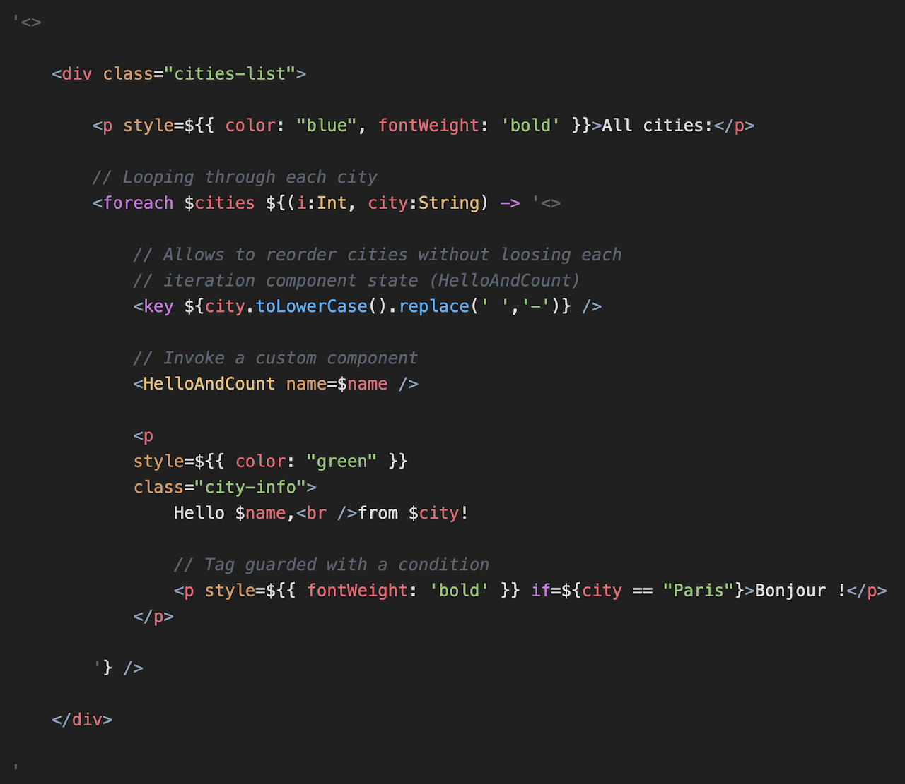

# Haxe Wisdom library syntax highlighting for Visual Studio Code

This extension adds markup colorization support for the syntax used by [wisdom](https://github.com/jeremyfa/wisdom) haxe library.

Extension initially based on [Jérémy Faivre](https://github.com/jeremyfa)'s declined pull request to the vshaxe extension [here](https://github.com/vshaxe/haxe-TmLanguage/pull/30) and on [haxe-jsx](https://marketplace.visualstudio.com/items?itemName=influrium.haxe-jsx) made from it.

